# 說明

* 本練習係學習Filter、Listener、Ajax之使用，練習內容如下：
  * 練習1：透過Filter過濾未登入用戶之訪問
  * 練習2：運用Ajax獲取當前日期時間寫回頁面
  * 練習3：運用Ajax(使用Axios套件)於用戶註冊階段響應已重複之用戶名(當用戶輸入框失去焦點時進行判定)
    * 本練習已內建兩組帳號密碼如下：
      * 帳號：testac01 密碼：password
      * 帳號：testac02 密碼：password
  * 練習4：運用Ajax(JSON格式)發送請求進行資料庫CRUD並回顯數據
    * 本練習已內建兩組帳號密碼同上(練習3)。
* 各部分練習結果如下：
  * 練習首頁：
    * 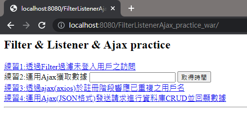
  * 練習1：
    * 已登入之用戶可訪問之頁面
      * 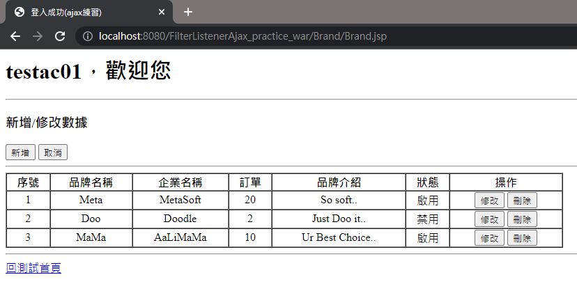
    * 未登入之用戶如輸入相同網址將依Filter設置導引至登入頁
      * 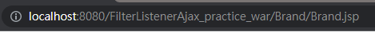
      * 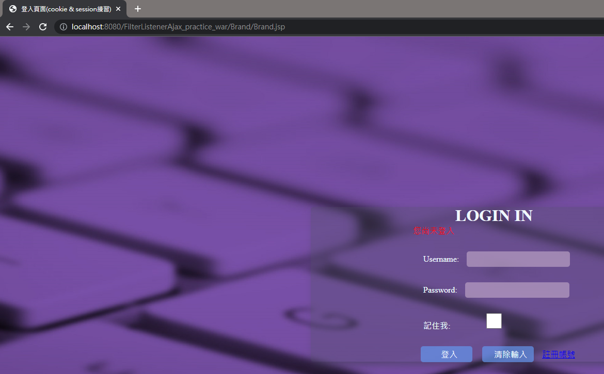
      * 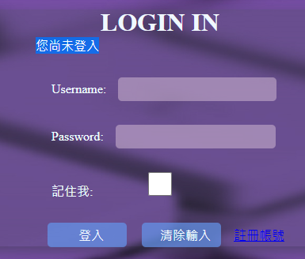
  * 練習2：
    * 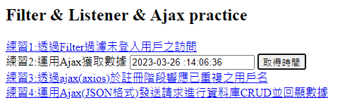
    * 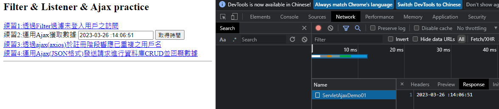
  * 練習3：
    * 輸入時
      * 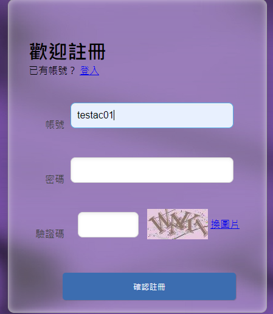
    * 失去焦點時
      * 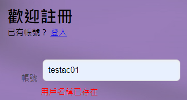
      * 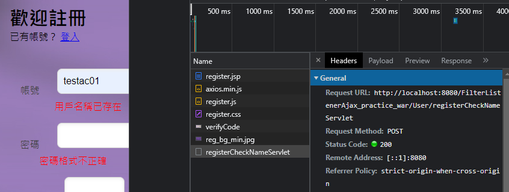
  * 練習4：
    * 查詢(登入頁面或完成增刪改即發送非同步請求)
      * 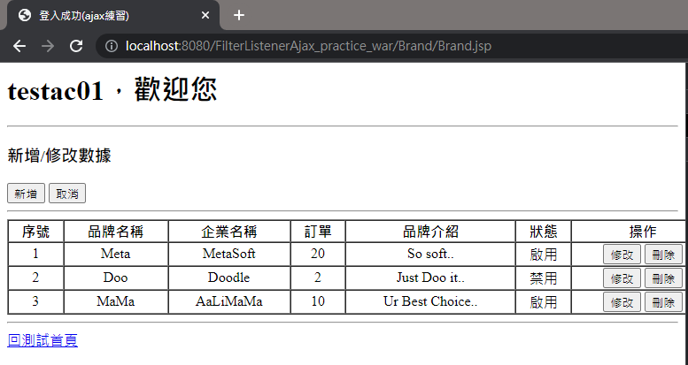
      * 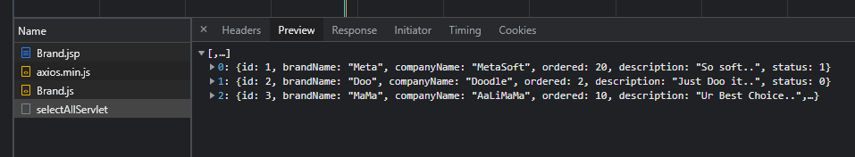
    * 新增(提交後發送非同步請求，確認成功後再發送非同步請求進行查詢)
      * 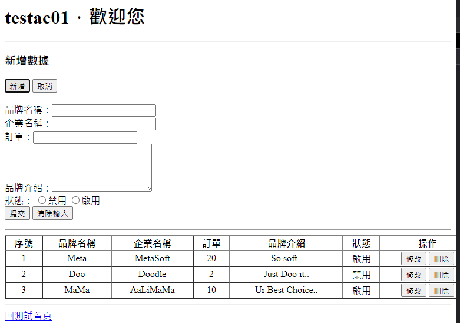
      * 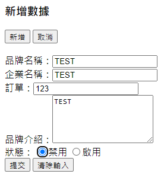
      * 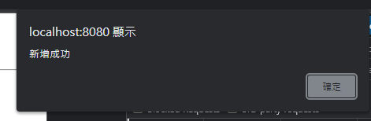
      * 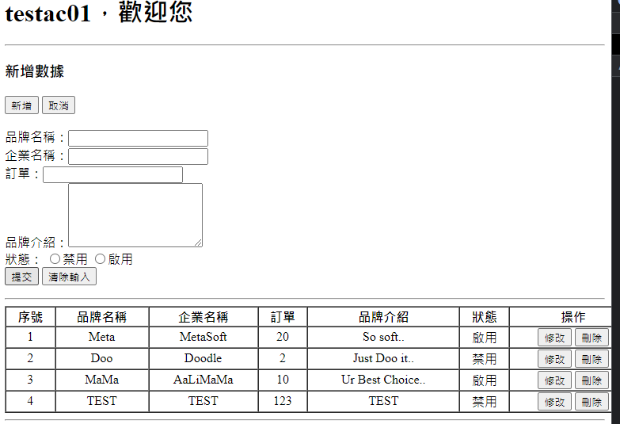
      * 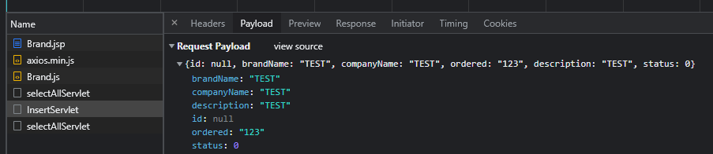
      * 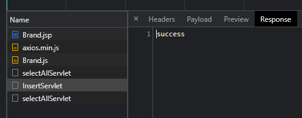
      * 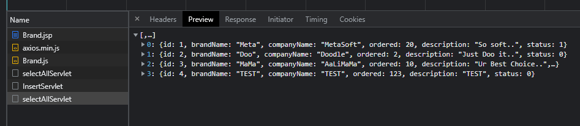
    * 修改(點選對應之修改按鈕發送非同步請求依據id查詢資料並進行回顯，提交後發送非同步請求，確認成功後再發送非同步請求進行查詢)
      * 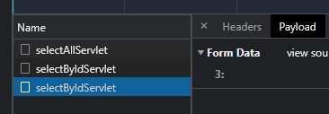
      * 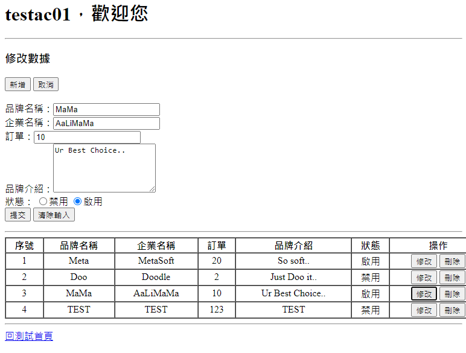
      * 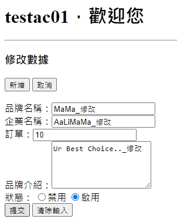
      * 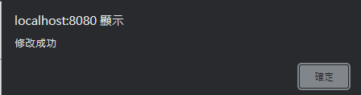
      * 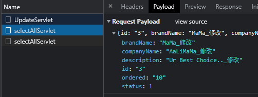
      * 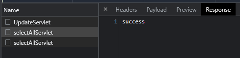
      * 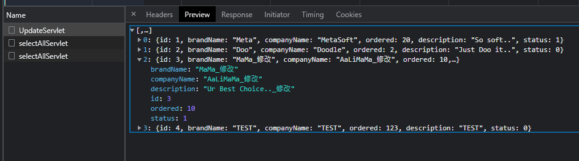
      * 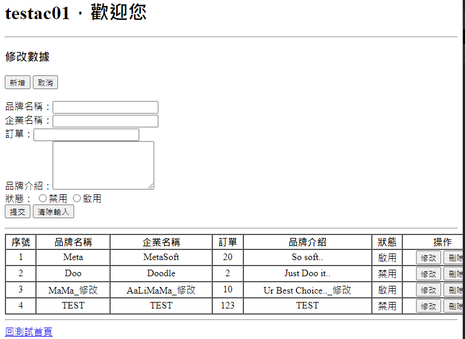
    * 刪除(點選對應之刪除按鈕發送非同步請求刪除特定id資料，確認成功後再發送非同步請求進行查詢)
      * 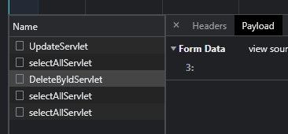
      * 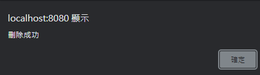
      * 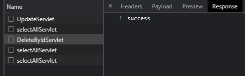
      * 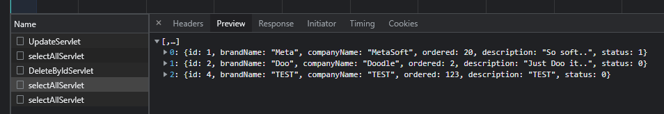
      * 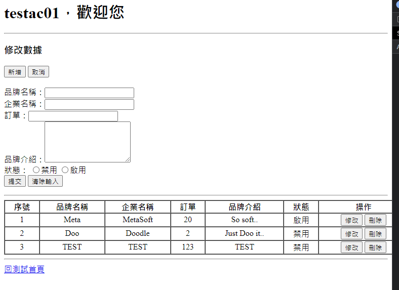
